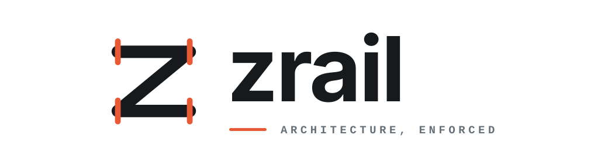

<p align="center">
  
</p>

<p align="center"><strong>Executable guardrails for human- and agent-written code.</strong></p>

zrail is a deterministic architecture checker for repositories. It turns
repository rules into local checks, path-specific guidance, and semantic diffs.
It requires no account, daemon, source upload, network request, API key, or LLM.

## Install

From this checkout:

```sh
cargo install --path crates/zrail-cli --locked
```


## Use

Create a zsumz-style contract and its resolved lock:

```sh
zrail init
```

The default `zsumz` preset uses sibling test files and 300-line source targets.
For conventional Rust organization, including inline unit tests and Cargo
integration tests, use:

```sh
zrail init --preset rust
```

The `rust` preset does not invent a universal source-file length limit. Both
presets write an explicit `zrail.toml`; the preset is not hidden policy.

Add `--baseline` to either preset when adopting an existing repository:

```sh
zrail init --baseline
zrail init --preset rust --baseline
```

Baseline records supported violations of the selected preset as exact,
tightening ratchets. New debt fails, cleanup makes the lock stale so it must
tighten, and unsupported violations abort initialization without partial files.

Check it, inspect one path, or review an architecture change:

```sh
zrail check
zrail explain --path crates/zrail-core/src/lib.rs
zrail diff --base HEAD --deny-grants
```

Protected automation can independently derive a proposal's observed state with
a binary and base revision outside the proposal's control:

```sh
zrail review --base HEAD --authority-root . --root proposal
```

`review` analyzes the proposed Cargo and Rust source as data, verifies its
checked-in lock against an in-memory candidate, and rejects source violations,
grants, new debt, unknown comparisons, and stale or forged locks by default.
`--allow-grants` is an explicit local exception for grants; debt and unknown
comparisons still fail. Automated and proposal-controlled merge checks must
never use it.

The included preview workflow demonstrates the safe computation: it builds only
the protected base, then reads the proposal without executing its actions,
scripts, Cargo, or build scripts. It is not a merge authority because a proposal
can add another workflow under the same GitHub Actions identity.

For merge authority, require either an organization ruleset workflow stored in
a separately protected repository or a dedicated GitHub App. Restrict the
required check to that exact App and require branches to be current with their
base. Repository-local GitHub Actions statuses are preview feedback only.

After an intentional dependency, provenance, gate, or ratchet change:

```sh
zrail update
```

`zrail update` uses committed `HEAD` architecture as its authority. Choose a
different independently reviewed revision with `--base REVISION`.

Policy changes and `zrail update --accept-grants` require explicit human
authorization. Agents should report `zrail diff` instead of accepting power.

Approve an intentional grant through protected authority:

1. Open a policy-only pull request and review its semantic diff.
2. A designated owner manually dispatches the separately protected authority
   workflow with that pull request number and explicit grant approval. The App
   status is bound to the proposal SHA; debt, unknowns, and source violations
   remain failures.
3. Merge the policy, rebase the implementation onto it, and require a clean
   automatic `zrail review` with no grant.

This keeps the exceptional decision in protected workflow history instead of
turning `--allow-grants` into a proposal-controlled CI switch.

A lock semantic-epoch change is deliberately `unknown`, not a grant. It needs a
separately reviewed, signed bootstrap because the protected older engine cannot
interpret the newer architecture state.

`zrail.toml` contains human-authored architecture. `zrail.lock` contains exact
normalized direct dependency declarations, reviewed gate bytes and their
declared behavioral inputs, generated provenance, content-bound repository
macro implementation packages, and ratchets. `zrail check` never modifies
either file.
Cargo owns exact selected versions, checksums, and Git commits in `Cargo.lock`;
zrail does not claim to be a second Cargo resolver.

## Checks

The Rust adapter enforces:

- exact Cargo workspace membership and source-aware dependency edges;
- inspected or reasoned Rust crate roots, including custom `[lib].name`, in
  source-policy facts and the architecture lock; external attestations bind to
  the exact registry or Git declaration, and roots that no active canonical
  policy relies on remain explicitly unresolved rather than guessed;
- package layers and allowed dependency direction;
- runtime and compile-time effect boundaries, capability owners, and direct-call
  owners;
- complete Rust source traversal, including reviewed generated and `OUT_DIR`
  snapshots;
- declarative facades, module contracts, and configurable test placement;
- source hygiene, optional file-size ceilings, and tightening ratchets; and
- invariants connected to exact tests and content-addressed qualification gates.

With `source.rust.macros.mode = "deny-unreviewed"`, macro expansions that zrail
cannot inspect are rejected unless their invocation path has a reasoned
allowance. Ordinary Rust expressions inside standard macro inputs are still
analyzed. Other token DSLs require the separate `inputs = "opaque"` grant.
Compiler built-ins come from a closed engine-known set. Repository-owned macros,
including module-qualified local macros and workspace or repository-path macro
crates, lock a deterministic manifest of their implementing package. This
covers helper macro and internal proc-macro changes. An optional `definition`
path can narrow a `macro_rules!` allowance, but path spelling never establishes
origin. External allowances bind to the exact dependency source. Built-in data
macros and `include!` are handled directly, and included Rust remains fully
analyzed.

`env!` and `option_env!` provide the `compile-environment` effect. `include!`,
`include_str!`, and `include_bytes!` provide `compile-filesystem`; literal file
inputs must resolve to inventoried files inside the repository. These are
separate from runtime `environment` and `filesystem` effects.

Bare allowances are conservative: when the package defines a local macro with
the same name, use a stable qualified path instead of borrowing a global name.
`#[macro_use]` imports remain unresolved because their bare namespace cannot be
attributed exactly without compiler expansion.

Contract parsing is strict. Unknown keys, stale policy, unresolved source
boundaries, missing evidence, and unreviewed lock changes fail closed.
Repository-controlled Cargo source overrides and registry mappings are rejected
until zrail can attest their effective resolution. Root `.cargo/config` and
`.cargo/config.toml` are rejected entirely because Cargo can use them to alter
dependency resolution and qualification execution.

`zrail diff` classifies changes as grants, revocations, debt, cleanup, neutral,
or unknown. `--deny-grants` rejects added power, new debt, and unsafe comparisons.

## CLI

```text
zrail init [ROOT] [--preset zsumz|rust] [--baseline]
zrail check [--root ROOT] [--format human|json]
zrail update [--base REVISION] [--root ROOT] [--format human|json] [--accept-grants]
zrail doctor [--root ROOT] [--format human|json]
zrail explain --path PATH [--root ROOT] [--format human|json]
zrail review [--base REVISION] [--authority-root ROOT] --root PROPOSAL [--allow-grants]
zrail diff --base REVISION [--root ROOT] [--deny-grants]
zrail diff --before ROOT --after ROOT [--deny-grants]
```

## Qualification

`QUAL-01` requires the reviewed local and hosted gates to remain connected to
exact test evidence. The lock hashes each gate and its declared behavioral
inputs, including helper scripts, workflow actions, the Rust toolchain,
formatting and lint configuration, and ignore rules, so changing effective
qualification behavior cannot pass silently.

`QUAL-02` requires pull requests to pass independent source analysis by a zrail
binary built from the protected base commit. It verifies observed source and the
proposed lock, so proposed checker changes cannot authorize violations or grants
in the same pull request. Its required result must come from a ruleset workflow
or App outside the proposal's write domain.

Run the complete offline repository gate with:

```sh
scripts/check
```

It checks structure, formatting, Clippy, tests, rustdoc, zrail itself, package
archives, whitespace, and that Git status is unchanged by the gate.

## Status

Version 0.0.1 is the initial release. It supports Rust and Cargo
repositories. zrail analyzes declared source and verified snapshots; it does not
execute repository code, Cargo, build scripts, gates, or generated programs.

## License

Apache-2.0. See [LICENSE](LICENSE).
